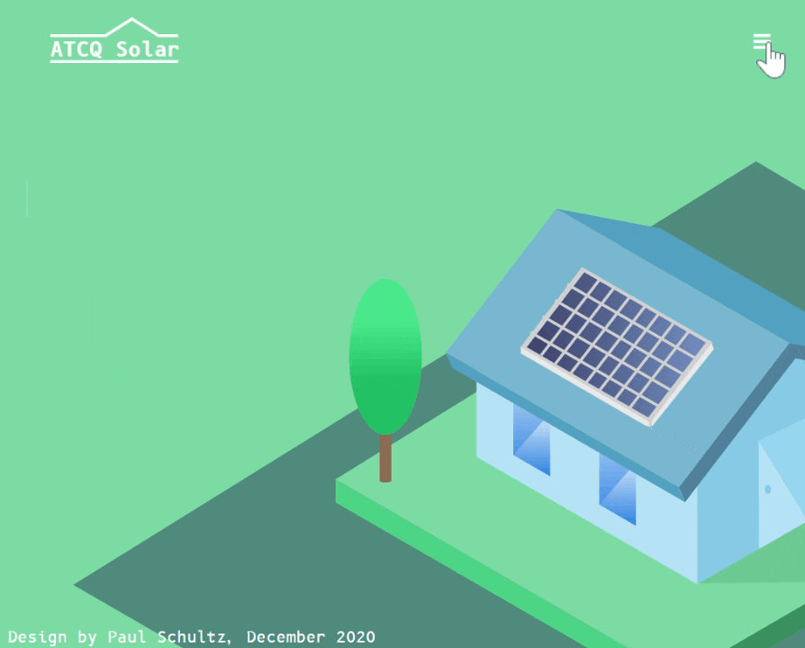

##solar_landing_page

To practice building a UI from scratch and then turning it into a fully functioning webpage I built this landing page for a fake solar website.   
To view the final product follow this link:  
github pages link  
To learn about how I built the page keep reading!  
I started off by creating a picture of a house with solar panels on it using vector illustration software:  
  
Then I exported the asset into my project directory and added a solid background with CSS:  
  
Followed by some content, a company logo, navbar, tagline, and call to action button:  
  
After getting the webpage set up it was time to bring it to life. The font I used, B6B12 Monospace, had a futuristic feel to it. So I thought it would be cool to animate the text so it looked like someone was typing it out on a computer. After the text was all typed out I had the call to action button fade in:  
  
Pretty happy with how that turned out. Now came the time to optimize for tablet. To do this I created a hamburger menu that would appear when the browser shrunk to 1024px. After which if the hamburger menu button was pressed, the navbar would appear in the form of an overlay. From here the user can follow one of the nav links, or press the X button to return to the landing page.
  